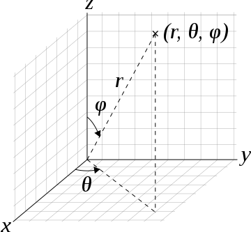
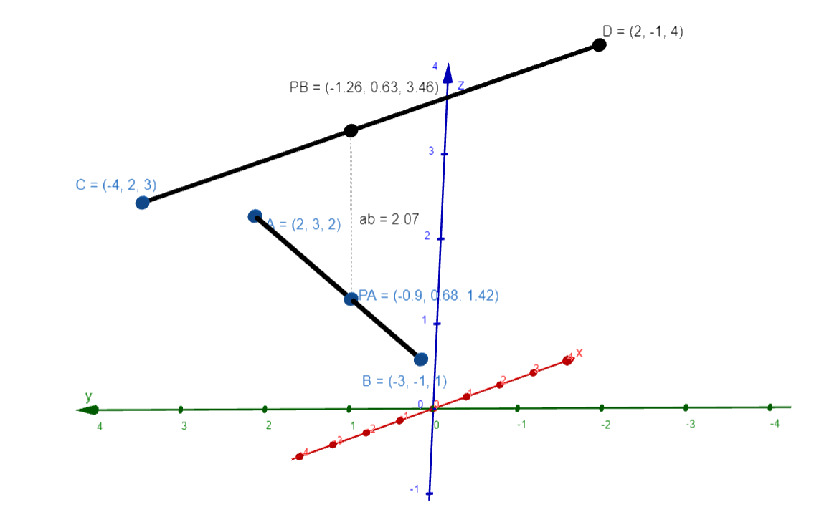

# 3D geometry
 3D geometry in JavaScript

## Vector

> Figure 1: the 3D space

Our vector is an object which extends standard Array object - derived as [Point](src/point/index.js?plain=1#L2) from javascript, see [source](src/vector/index.js?plain=1#L3).

### Static methods

- [dist](src/vector/index.js#L157) - distance between two vectors
- [dot](src/vector/index.js#L150) - dot product
- [cross](src/vector/index.js#L136) - cross product
- [direction](src/vector/index.js#L89) - angle components of 3D vector see [Figure 1](README.md#L4) above
- [norm](src/vector/index.js#L75) - normalize vector
- [sub](src/vector/index.js#L58) - subtract
- [add](src/vector/index.js#L41) - addition
- [scale](src/vector/index.js#L30) - product or divide by scalar
- [mag](src/vector/index.js#L19) - magnitude
- [unit](src/vector/index.js#L8) - unit vector (*see norm*)

--------------------------------------------------------------------

## Segment

> Figure 2: the result of two skew segments distance represented by *ab* segment

### Static method

- [intsect](segment/index.js#L76) - calculates shortest distance between two skew line segment in 3D space.

*Note: line segments must not be parallel and not coplanar - they must be on the same plane.*
